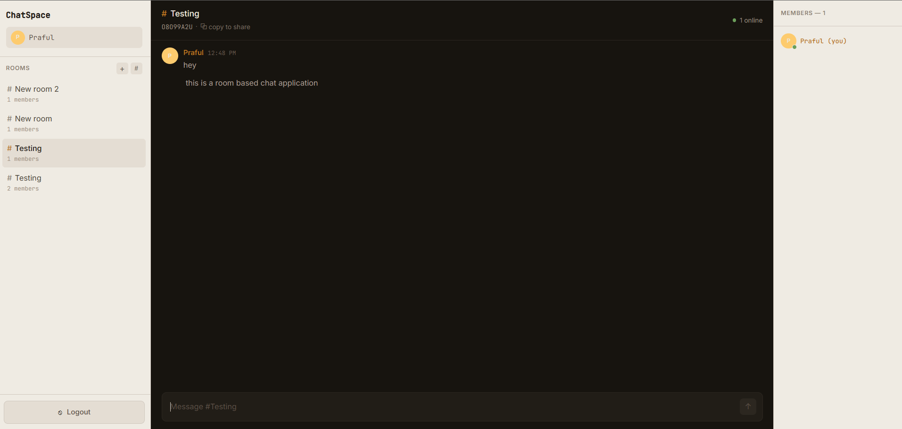
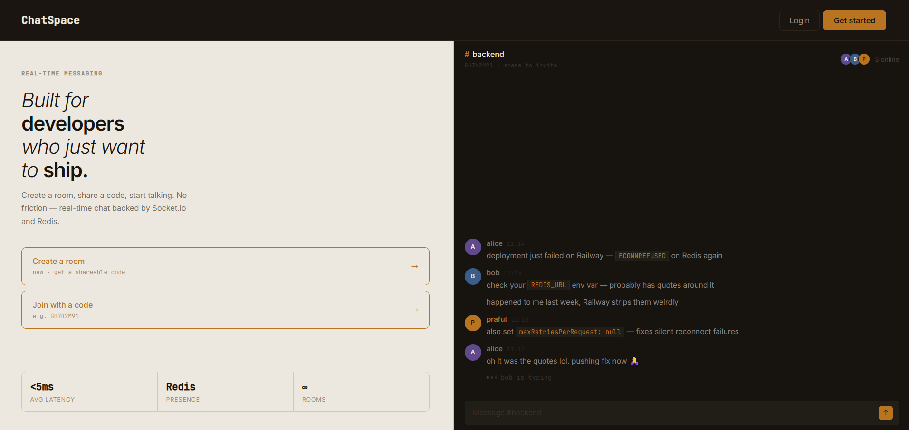
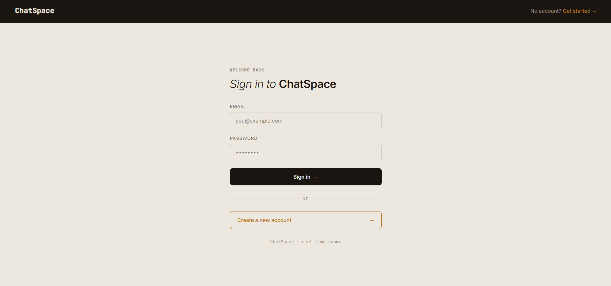
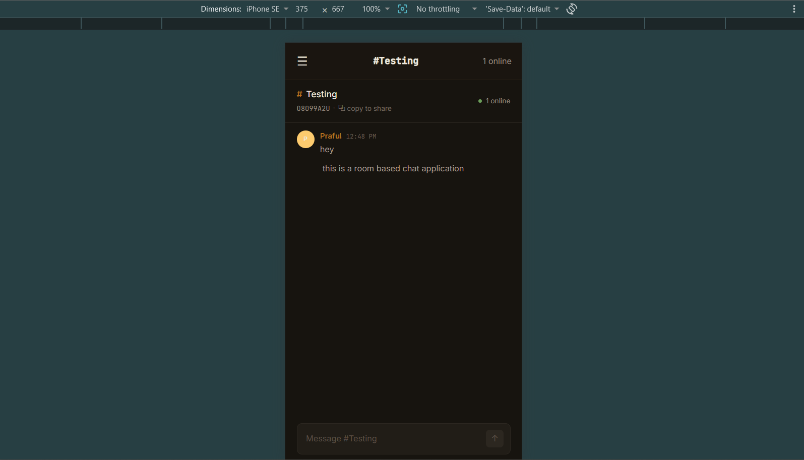

# ChatSpace

A real-time chat application with room-based messaging, live presence tracking, and Redis-backed rate limiting — built as a companion project to [Sniplink](#) to demonstrate WebSocket architecture, relational data modeling, and containerized deployment.

**Live app:** [https://chat-app-lilac-rho.vercel.app](#)
**Backend API:** [https://chat-app-production-f3b6.up.railway.app](#)



---

## Why This Exists

Sniplink covered HTTP request/response patterns, caching, and analytics. ChatSpace was built to cover what Sniplink didn't — real-time bidirectional communication, a relational database with actual foreign-key relationships, and containerized deployment. Every technology choice here was deliberate, made to fill a specific gap rather than to pad a tech-stack list.

---

## Features

- **JWT Authentication** — signup/login, same pattern as Sniplink for consistency
- **Room-based messaging** — create a room, get a shareable code, others join with that code
- **Real-time messaging (Socket.io)** — instant delivery to everyone in a room
- **Live presence** — Redis-tracked online/offline status, broadcast to the whole room on join/leave
- **Typing indicators** — start/stop events, with automatic cleanup on disconnect so indicators never get stuck
- **Redis-backed rate limiting** — 5 messages per 10 seconds per user, same INCR + TTL pattern as Sniplink, fails open if Redis is unreachable
- **Cursor-based message pagination** — "load older messages" without offset drift
- **Message grouping** — consecutive messages from the same sender collapse visually, like Slack/Discord
- **Fully responsive UI** — sidebar and members panel collapse into slide-out panels on mobile

---

## Tech Stack

**Backend:** Node.js, Express, Socket.io, PostgreSQL (via Prisma ORM, hosted on Supabase), Redis (Upstash), JWT, Jest
**Frontend:** React, React Router, Socket.io-client
**Infra:** Docker, Railway (backend), Vercel (frontend)

---

## Architecture Notes

A few decisions worth explaining, since they came from real debugging rather than upfront design:

**PostgreSQL over MongoDB, deliberately.** Sniplink used MongoDB because URL records don't have meaningful relationships. Chat data is the opposite — users belong to rooms, messages belong to both a user and a room, room membership is a many-to-many relationship. PostgreSQL enforces these with foreign keys and `ON DELETE CASCADE`/`SET NULL`, and a "give me the last 50 messages with sender info" query is a single JOIN instead of an aggregation pipeline.

**Region mismatch caused a real production slowdown.** After deploying, every action felt sluggish — logins, message sends, member updates. The backend was running in Railway's US-West region while the Postgres database (Supabase) was in `ap-south-1` (Mumbai). Every query was making a US↔India round trip. Moving the Railway service to Southeast Asia (geographically closest available region to Mumbai) fixed it immediately. This is the kind of latency issue that only shows up after deployment, not in local development.

**Prisma + PgBouncer needed an explicit flag.** Supabase's connection pooler (used because Railway, as a serverless-style host, benefits from pooled connections) doesn't support prepared statements the way Prisma expects by default. Adding `?pgbouncer=true` to the connection string tells Prisma to skip prepared statements and use a compatible query mode.

**Docker on Alpine broke Prisma's engine.** The first Dockerfile used `node:20-alpine` for a smaller image, but Prisma's query engine binary is compiled against `glibc`/OpenSSL and doesn't run cleanly on Alpine's `musl` libc — it failed with a missing `libssl.so.1.1` error. Switched to `node:20-slim` (Debian-based) and explicitly installed OpenSSL in the Dockerfile before generating the Prisma client.

**Rate limiter refactored for testability.** The rate limiter originally imported the Redis client directly at the module level, which made it impossible to unit test without a real Redis connection. Refactored to a factory function — `createMessageLimiter(redis)` — that accepts the Redis client as a parameter. Production code passes the real client; tests pass a mock. This is dependency injection, and it's why the rate limiter has actual unit tests instead of being untested glue code.

**Typing indicators used to get stuck.** If a user was typing and disconnected (closed the tab, lost connection), the "X is typing…" indicator stayed visible for other users indefinitely. Fixed by explicitly emitting `typing:stop` in the socket's `disconnect` handler, and by including `username` in both `typing:start` and `typing:stop` payloads so the frontend can reliably match and remove the right entry.

---

## Screenshots

| Landing | Chat |
|---|---|
|  |  |

| Login | Mobile view |
|---|---|
|  |  |

---

## Testing

Unit tests (Jest) cover:
- **JWT auth middleware** — missing token, invalid token, valid token, expired token
- **Rate limiter** — under limit, over limit, and fail-open behavior when Redis throws

```bash
npm test
```

---

## Running Locally

**Backend**
```bash
cd BACKEND
npm install
# create a .env file — see below
npm run dev
```

**With Docker instead:**
```bash
cd BACKEND
docker-compose up --build
```

**Frontend**
```bash
cd FRONTEND
npm install
# create a .env file with VITE_API_URL and VITE_SOCKET_URL
npm run dev
```

### Environment Variables

**Backend `.env`**
```
DATABASE_URL=            # Supabase pooler URL, with ?pgbouncer=true
UPSTASH_REDIS_REST_URL=
UPSTASH_REDIS_REST_TOKEN=
JWT_SECRET=
FRONTEND_URL=
PORT=3000
```

**Frontend `.env`**
```
VITE_API_URL=
VITE_SOCKET_URL=
```

---

## Project Structure

```
BACKEND/
├── src/
│   ├── config/         # Prisma client, Redis client
│   ├── controller/      # Auth, room route handlers
│   ├── middleware/       # JWT auth, rate limiter (factory pattern)
│   ├── routes/
│   ├── socket/           # Socket.io connection + event handlers
│   └── app.js
├── prisma/
│   └── schema.prisma
├── tests/
│   ├── auth.middleware.test.js
│   └── rateLimiter.test.js
├── Dockerfile
└── docker-compose.yml

FRONTEND/
├── src/
│   ├── api/              # REST client
│   ├── context/          # Auth context
│   ├── pages/             # Landing, Login, Register, Chat
│   └── socket/            # Socket.io client singleton
```

---

## Built By

Praful Suryawanshi